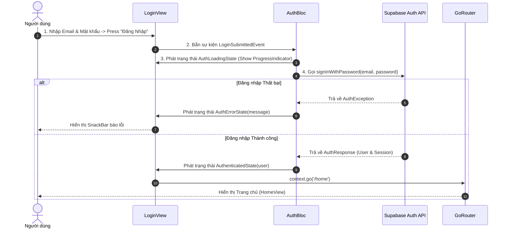

# 🔐 PHÂN HỆ 1: KHỞI ĐỘNG & XÁC THỰC (AUTH & SPLASH)

Tài liệu chi tiết về hành động Giao diện (UI Action), luồng xử lý hệ thống (Execution Flow) và sơ đồ chức năng cho phân hệ Khởi động & Xác thực.

---

## 1. Thành phần Giao diện & Thao tác UI (UI Actions)

* **Màn hình Splash ([splash_view.dart](file:///c:/Users/khoa/movie_app/lib/features/splash/views/splash_view.dart)):**
  * **Chạy tự động:** Tải logo, khởi tạo Hive DB & Supabase SDK.

* **Màn hình Đăng nhập ([login_view.dart](file:///c:/Users/khoa/movie_app/lib/features/auth/views/login_view.dart)):**
  * `[TextField] Email`: Nhập email tài khoản.
  * `[TextField] Password`: Nhập mật khẩu (hỗ trợ nút ẩn/hiện mắt `Icons.visibility_outlined`).
  * `[Button] Đăng Nhập`: Gửi thông tin đăng nhập lên Supabase Auth.
  * `[Button] Trải nghiệm Khách`: Kích hoạt chế độ Khách (Guest Mode) không cần tài khoản.
  * `[Link] Quên mật khẩu?`: Chuyển sang màn hình khôi phục mật khẩu.
  * `[Link] Đăng ký ngay`: Chuyển sang màn hình tạo tài khoản mới.

* **Màn hình Đăng ký ([register_view.dart](file:///c:/Users/khoa/movie_app/lib/features/auth/views/register_view.dart)):**
  * `[TextField] Họ tên & Email & Mật khẩu`: Nhập thông tin người dùng mới.
  * `[Button] Tạo tài khoản`: Đăng ký người dùng mới với máy chủ Supabase.

* **Màn hình Quên mật khẩu ([forgot_password_view.dart](file:///c:/Users/khoa/movie_app/lib/features/auth/views/forgot_password_view.dart)):**
  * `[TextField] Email`: Nhập email cần lấy lại mật khẩu.
  * `[Button] Gửi yêu cầu`: Gửi email xác thực khôi phục qua Supabase Auth API.

---

## 2. Ma trận Ánh xạ Luồng (UI Action -> Execution Flow)

| Thao tác UI (Action) | Component / Widget | Luồng xử lý Hệ thống (Execution Flow) |
| :--- | :--- | :--- |
| **Mở ứng dụng** | `SplashView` | Check Supabase Session -> Điều hướng `home` hoặc `login`. |
| **Press "Đăng Nhập"** | `LoginView` | Validate Form -> `LoginSubmittedEvent` -> `LoginUseCase` -> Supabase `signInWithPassword` -> Save Profile -> Route `home`. |
| **Press "Trải nghiệm Khách"** | `LoginView` | `UserSession.setGuestMode(true)` -> Route `home`. |
| **Press "Tạo tài khoản"** | `RegisterView` | Validate Form -> `RegisterSubmittedEvent` -> `RegisterUseCase` -> Supabase `signUp` -> Route `login`. |
| **Press "Gửi yêu cầu"** | `ForgotPasswordView` | Validate Email -> `ResetPasswordSubmittedEvent` -> Supabase `resetPasswordForEmail` -> SnackBar thông báo. |

---

## 3. Sơ đồ Luồng Hoạt động (Mermaid Diagram)

