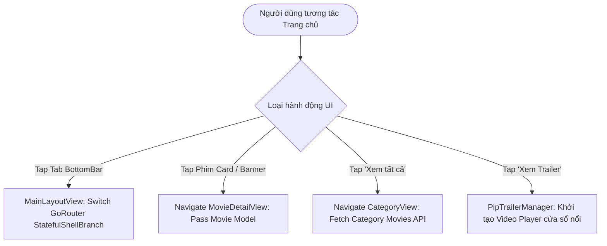

# 🏠 PHÂN HỆ 2: TRANG CHỦ & ĐIỀU HƯỚNG (HOME & NAVIGATION)

Tài liệu chi tiết về hành động Giao diện (UI Action), luồng xử lý hệ thống (Execution Flow) và sơ đồ chức năng cho phân hệ Trang chủ & Thanh điều hướng chính.

---

## 1. Thành phần Giao diện & Thao tác UI (UI Actions)

* **Thanh điều hướng chính ([main_layout_view.dart](file:///c:/Users/khoa/movie_app/lib/features/home/views/main_layout_view.dart)):**
  * `[BottomNavigationBar] 4 Tab chính`:
    * Tab 0: Trang chủ (`RoutePath.home`)
    * Tab 1: Danh sách xem sau (`RoutePath.watchlist`)
    * Tab 2: Danh sách yêu thích (`RoutePath.favorites`)
    * Tab 3: Trang cá nhân (`RoutePath.profile`)

* **Trang chủ ([home_view.dart](file:///c:/Users/khoa/movie_app/lib/features/home/views/home_view.dart)):**
  * `[Carousel] Banner Xu hướng (Trending Carousel)`: Vuốt ngang hoặc tap vào poster phim xu hướng để mở trang Chi tiết phim.
  * `[Chip / Button] Xem tất cả Danh mục`: Tap vào "Phim phổ biến", "Đánh giá cao", "Phim đang chiếu" để mở màn hình danh mục mở rộng (`CategoryView`).
  * `[Card] Poster Phim`: Click vào thẻ phim bất kỳ để điều hướng sang `MovieDetailView`.
  * `[Button] Xem Trailer`: Bấm nút xem trailer để khởi động cửa sổ xem video nổi `PipTrailerManager` hoặc Dialog.

* **Màn hình Danh mục Phim ([category_view.dart](file:///c:/Users/khoa/movie_app/lib/features/home/views/category_view.dart)):**
  * `[Tab/Dropdown] Chọn loại danh mục`: Tải lại danh sách phim dạng GridView theo thể loại/danh mục đã chọn.

---

## 2. Ma trận Ánh xạ Luồng (UI Action -> Execution Flow)

| Thao tác UI (Action) | Component / Widget | Luồng xử lý Hệ thống (Execution Flow) |
| :--- | :--- | :--- |
| **Tap Icon Tab Bar** | `MainLayoutView` | `navigationShell.goBranch(index)` -> Swaps IndexedStack screen view. |
| **Vuốt/Tap Poster Banner** | `TrendingCarouselWidget` | State Navigation -> `context.push('/movie-detail', extra: movie)`. |
| **Tap "Xem tất cả"** | `HomeView` | `context.push('/category/popular')` -> Triggers Category Fetch API. |
| **Tap Icon Xem Trailer** | `MovieCard` / Banner | Triggers `PipTrailerManager.show()` / Open `TrailerPlayerDialog`. |

---

## 3. Sơ đồ Luồng Hoạt động (Mermaid Diagram)

