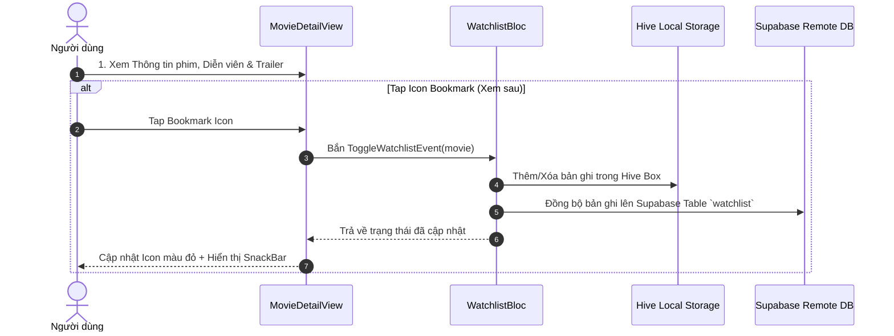

# 🎬 PHÂN HỆ 3: CHI TIẾT PHIM & TRAILER (MOVIE DETAIL & TRAILER)

Tài liệu chi tiết về hành động Giao diện (UI Action), luồng xử lý hệ thống (Execution Flow) và sơ đồ chức năng cho phân hệ Xem chi tiết phim và phát Trailer.

---

## 1. Thành phần Giao diện & Thao tác UI (UI Actions)

* **Màn hình Chi tiết Phim ([movie_detail_view.dart](file:///c:/Users/khoa/movie_app/lib/features/home/views/movie_detail_view.dart)):**
  * `[Header Backdrop & Poster]`: Hiển thị ảnh bìa sắc nét với hiệu ứng làm mờ Glassmorphism.
  * `[Badge / Text] Thông tin tổng quan`: Tên phim, Thể loại, Điểm đánh giá, Thời lượng, Năm phát hành, Đạo diễn, Mô tả kịch bản.
  * `[Button] Phát Trailer`: Bấm nút Play để phát Video Trailer trong `TrailerPlayerDialog`.
  * `[Button] Thêm vào Watchlist (Bookmark)`: Lưu phim vào Danh sách xem sau.
  * `[Button] Thêm vào Yêu thích (Heart)`: Đánh dấu phim yêu thích.
  * `[Section] Danh sách Diễn viên ([cast_section_widget.dart](file:///c:/Users/khoa/movie_app/lib/features/home/presentation/widgets/cast_section_widget.dart))`: Cuộn ngang xem ảnh và tên các diễn viên.
  * `[Section] Phim đề xuất tương tự`: Click thẻ phim tương tự để mở trang chi tiết phim mới.

---

## 2. Ma trận Ánh xạ Luồng (UI Action -> Execution Flow)

| Thao tác UI (Action) | Component / Widget | Luồng xử lý Hệ thống (Execution Flow) |
| :--- | :--- | :--- |
| **Tap nút "Phát Trailer"** | `MovieDetailView` | Fetch Trailers API -> Mở `TrailerPlayerDialog` / Youtube IFrame Player. |
| **Tap Icon Bookmark** | `MovieDetailView` | `WatchlistBloc` (`ToggleWatchlistEvent`) -> Sync Hive DB & Supabase Remote DB. |
| **Tap Icon Heart** | `MovieDetailView` | `FavoritesBloc` (`ToggleFavoriteEvent`) -> Sync Database. |
| **Tap Card Phim tương tự** | `MovieDetailView` | `context.push('/movie-detail', extra: similarMovie)`. |

---

## 3. Sơ đồ Luồng Hoạt động (Mermaid Diagram)

