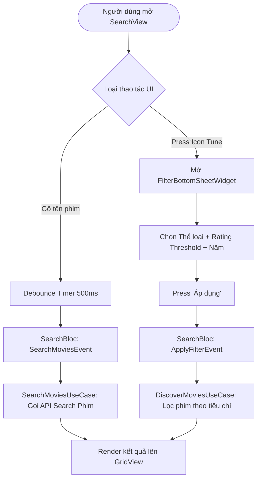

# 🔍 PHÂN HỆ 4: TÌM KIẾM & LỌC NÂNG CAO (SEARCH & FILTER)

Tài liệu chi tiết về hành động Giao diện (UI Action), luồng xử lý hệ thống (Execution Flow) và sơ đồ chức năng cho phân hệ Tìm kiếm từ khóa và Lọc phim nâng cao.

---

## 1. Thành phần Giao diện & Thao tác UI (UI Actions)

* **Màn hình Tìm kiếm ([search_view.dart](file:///c:/Users/khoa/movie_app/lib/features/search/views/search_view.dart)):**
  * `[TextField] Search Input Bar`: Gõ từ khóa tên phim hoặc đạo diễn. Hệ thống áp dụng **Debounce 500ms** tự động gửi yêu cầu tìm kiếm mà không cần bấm Enter.
  * `[Button] Clear Search ('X')`: Xóa nội dung tìm kiếm hiện tại và reset kết quả.
  * `[Button] Icon Tune (Bộ lọc)`: Mở bảng lọc nâng cao `FilterBottomSheetWidget`.
  * `[Grid] Kết quả Tìm kiếm`: Hiển thị danh sách các phim phù hợp với từ khóa/bộ lọc.

* **Bảng Lọc nâng cao ([filter_bottom_sheet_widget.dart](file:///c:/Users/khoa/movie_app/lib/features/search/presentation/widgets/filter_bottom_sheet_widget.dart)):**
  * `[Chips] Thể loại (Genres)`: Chọn một hoặc nhiều thể loại (Hành động, Hài, Viễn tưởng,...).
  * `[Slider] Điểm đánh giá tối thiểu (Rating)`: Chọn ngưỡng điểm đánh giá (từ 1.0 đến 10.0).
  * `[Dropdown] Năm phát hành & Sắp xếp`: Lọc theo năm phát hành phim hoặc sắp xếp theo độ hot.
  * `[Button] Áp dụng Bộ lọc`: Xác nhận các tiêu chí và thực thi tìm kiếm phim nâng cao.

---

## 2. Ma trận Ánh xạ Luồng (UI Action -> Execution Flow)

| Thao tác UI (Action) | Component / Widget | Luồng xử lý Hệ thống (Execution Flow) |
| :--- | :--- | :--- |
| **Gõ từ khóa ô Search** | `SearchView` | Debounce 500ms -> `SearchBloc` (`SearchMoviesEvent`) -> `SearchMoviesUseCase` -> TMDB Search API -> Render UI. |
| **Click Icon Clear** | `SearchView` | `SearchBloc` (`ClearSearchEvent`) -> Reset search state & query input. |
| **Press "Áp dụng" lọc** | `FilterBottomSheetWidget` | `SearchBloc` (`ApplyFilterEvent`) -> `DiscoverMoviesUseCase(filter)` -> Render filtered grid. |

---

## 3. Sơ đồ Luồng Hoạt động (Mermaid Diagram)

