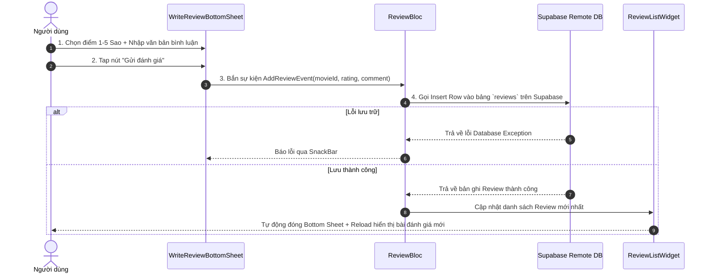

# ⭐️ PHÂN HỆ 5: ĐÁNH GIÁ & BÌNH LUẬN (REVIEWS & RATINGS)

Tài liệu chi tiết về hành động Giao diện (UI Action), luồng xử lý hệ thống (Execution Flow) và sơ đồ chức năng cho phân hệ Đánh giá và Chấm điểm sao cho phim.

---

## 1. Thành phần Giao diện & Thao tác UI (UI Actions)

* **Danh sách Đánh giá ([review_list_widget.dart](file:///c:/Users/khoa/movie_app/lib/features/review/presentation/widgets/review_list_widget.dart)):**
  * `[Card Đánh giá] ([review_card_widget.dart](file:///c:/Users/khoa/movie_app/lib/features/review/presentation/widgets/review_card_widget.dart))`: Hiển thị avatar, tên người đánh giá, số sao chấm (1-5 sao), ngày đăng và nội dung bình luận.
  * `[Button] Viết đánh giá`: Mở cửa sổ nhập bình luận `WriteReviewBottomSheet`.

* **Cửa sổ Nhập Đánh giá ([write_review_bottom_sheet.dart](file:///c:/Users/khoa/movie_app/lib/features/review/presentation/widgets/write_review_bottom_sheet.dart)):**
  * `[RatingBar] Chấm điểm sao`: Chọn điểm từ 1 đến 5 sao.
  * `[TextField] Nhận xét`: Nhập nội dung bình luận cảm nghĩ về bộ phim.
  * `[Button] Gửi đánh giá`: Đăng bài đánh giá lên hệ thống cơ sở dữ liệu Supabase.

---

## 2. Ma trận Ánh xạ Luồng (UI Action -> Execution Flow)

| Thao tác UI (Action) | Component / Widget | Luồng xử lý Hệ thống (Execution Flow) |
| :--- | :--- | :--- |
| **Mở màn hình chi tiết** | `ReviewListWidget` | `ReviewBloc` (`FetchReviewsEvent`) -> Query bảng `reviews` từ Supabase Database. |
| **Press "Viết đánh giá"** | `ReviewListWidget` | Check Guest Mode -> Mở `WriteReviewBottomSheet`. |
| **Press "Gửi đánh giá"** | `WriteReviewBottomSheet` | Validate -> `ReviewBloc` (`AddReviewEvent`) -> Insert bản ghi mới vào Supabase DB -> Reload danh sách. |

---

## 3. Sơ đồ Luồng Hoạt động (Mermaid Diagram)

