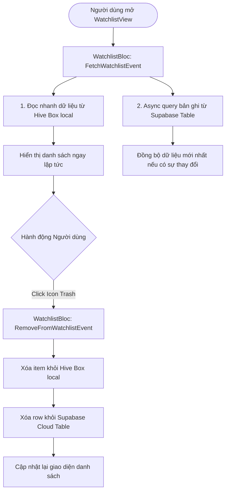

# 📌 PHÂN HỆ 6: QUẢN LÝ BỘ SƯU TẬP (WATCHLIST & FAVORITES)

Tài liệu chi tiết về hành động Giao diện (UI Action), luồng xử lý hệ thống (Execution Flow) và sơ đồ chức năng cho phân hệ Quản lý Danh sách Xem sau (Watchlist) và Danh sách Yêu thích (Favorites).

---

## 1. Thành phần Giao diện & Thao tác UI (UI Actions)

* **Danh sách Xem sau ([watchlist_view.dart](file:///c:/Users/khoa/movie_app/lib/features/watchlist/presentation/views/watchlist_view.dart)):**
  * `[Grid / ListView] Phim đã lưu`: Hiển thị danh sách các bộ phim đã lưu để xem sau.
  * `[Button] Icon Trash (Xóa)`: Click biểu tượng thùng rác để xóa phim khỏi danh sách xem sau.
  * `[Button] Khám phá phim ngay`: Hiển thị khi danh sách rỗng, click để chuyển sang Trang chủ.

* **Danh sách Yêu thích ([favorites_view.dart](file:///c:/Users/khoa/movie_app/lib/features/favorites/views/favorites_view.dart)):**
  * `[Grid] Phim yêu thích`: Hiển thị các bộ phim đã được thả tim yêu thích.
  * `[Button] Icon Heart`: Bỏ chọn yêu thích để xóa phim khỏi bộ sưu tập.

---

## 2. Ma trận Ánh xạ Luồng (UI Action -> Execution Flow)

| Thao tác UI (Action) | Component / Widget | Luồng xử lý Hệ thống (Execution Flow) |
| :--- | :--- | :--- |
| **Mở Tab Watchlist** | `WatchlistView` | `WatchlistBloc` (`FetchWatchlistEvent`) -> Query dữ liệu từ Hive DB local & đồng bộ Supabase Cloud. |
| **Click Icon Trash** | `WatchlistView` | `WatchlistBloc` (`RemoveFromWatchlistEvent`) -> Delete bản ghi Hive DB & Supabase Table -> Re-render list. |
| **Click Icon Heart** | `FavoritesView` | `FavoritesBloc` (`RemoveFavoriteEvent`) -> Cập nhật Database local/cloud. |

---

## 3. Sơ đồ Luồng Hoạt động (Mermaid Diagram)

