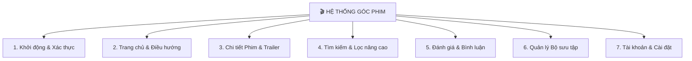

# HƯỚNG DẪN & TỔNG HỢP SƠ ĐỒ CHỨC NĂNG (GÓC PHIM)

Tài liệu này chứa danh sách các sơ đồ chức năng và mô tả chi tiết luồng xử lý (Action UI -> Execution Flow -> Database) cho tất cả các phân hệ trong ứng dụng **Góc Phim (`movie_app`)**.

---

## 📂 Danh sách Tài liệu Chức năng (Feature Specifications)

| STT | Phân hệ (Module) | Tệp Tài liệu (.md) | Mô tả ngắn |
| :---: | :--- | :--- | :--- |
| **01** | **Khởi động & Xác thực** | [01_auth_flow.md](file:///c:/Users/khoa/movie_app/docs/features/01_auth_flow.md) | Splash, Đăng nhập, Đăng ký, Quên mật khẩu, Chế độ Khách. |
| **02** | **Trang chủ & Điều hướng** | [02_home_navigation.md](file:///c:/Users/khoa/movie_app/docs/features/02_home_navigation.md) | Navigation Bar, Trending Carousel, Phim theo Danh mục, PiP Trailer. |
| **03** | **Chi tiết Phim & Trailer** | [03_movie_detail.md](file:///c:/Users/khoa/movie_app/docs/features/03_movie_detail.md) | Thông tin phim, Diễn viên, Trailer Player, Phim đề xuất. |
| **04** | **Tìm kiếm & Lọc nâng cao** | [04_search_and_filter.md](file:///c:/Users/khoa/movie_app/docs/features/04_search_and_filter.md) | Tìm kiếm từ khóa, Bộ lọc Thể loại/Năm/Rating, Debounce. |
| **05** | **Đánh giá & Bình luận** | [05_reviews_and_ratings.md](file:///c:/Users/khoa/movie_app/docs/features/05_reviews_and_ratings.md) | Xem đánh giá cộng đồng, Chấm sao & Viết nhận xét (Supabase). |
| **06** | **Quản lý Bộ sưu tập** | [06_watchlist_and_favorites.md](file:///c:/Users/khoa/movie_app/docs/features/06_watchlist_and_favorites.md) | Danh sách Xem sau, Yêu thích, Đồng bộ Hive DB & Supabase. |
| **07** | **Tài khoản & Cá nhân** | [07_profile_and_settings.md](file:///c:/Users/khoa/movie_app/docs/features/07_profile_and_settings.md) | Đổi thông tin cá nhân, Lịch sử đã xem, Đổi Dark/Light Mode. |

---

## 🌐 Sơ đồ Cây Chức năng Tổng thể (Master Functional Tree)

